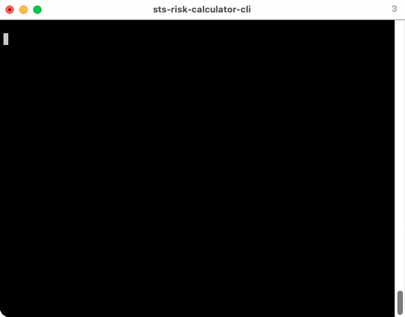

<div align="center">
 <h1><strong>Bulk STS Risk Calculator Query Tool</strong></h1>

[](https://opensource.org/licenses/MIT)
[](https://github.com/python/black)


Repeatedly query the Society of Thoracic Surgeons Adult Cardiac Risk Calculator using bulk .csv patient data.




</div>


# Overview
This is a minimalist Python command line tool to query the STS risk calculator with bulk patient records. This returns all available mortality and complication data from the STS. There is no upper limit to your query size -- this has been successfully run on datasets of ~500+ patients. 

The STS Calculator itself is a black box — patient parameters are passed to the STS API and a risk is returned (almost no computing happens client side).  A few obvious parameters impact mortality heavily (e.g. ESRD).


## Features
- Programmatically queries the STS [Short-Term Risk Calculator](https://www.sts.org/resources/risk-calculator) (version 4.2)
- Parses input .csv records of patients
- Performs automatic validation of most input records
- Optionally override individual parameters from your bulk records
    - For example, how does mortality change if all patients have the same age or renal function?
- Returns all avalable STS risk model parameters (mortality, prolonged ventilation, reoperation, etc.)


# Example Usage

You must provide a CSV with a unique **id** per row, followed by a minimum of **procid**, **age**, **weightkg**, and **heightkg**. All other parameters are optional.

The most critical step is formatting your data to **exactly** match the STS risk parameter names & values ([detailed here](#sts-parameters)). The calculator API is inflexible -- spacing, capitalization, etc. must be identical to the STS database.


### 1. Define input patient .csv (e.g. sample_data.csv)
```
id,procid,age,gender,surgdt,weightkg,heightcm,creatlst,payorprim
1,1,56,Male,08/11/2017,72,124,1.5,"Commercial Health Insurance"
2,3,72,Female,12/16/2018,60,96,2.9,
3,4,42,Male,7/21/2021,50,110,1.2,"Non-U.S. Plan"
```

### 2. Run sts-query

```
$ ./sts-query.py --csv sample_data.csv --output sample_results.csv
Validating CSV entries...
Valid!

Querying STS API.
100%|█████████████████████████████████████████████████████████████| 3/3 [00:01<00:00,  2.34it/s]

Done!
Results written to: sample_results.csv
```

### 3. Inspect results
```
$ cat sample_results.csv
id,predmort,predmm,preddeep,pred14d,predstro,predvent,predrenf,predreop,pred6d
1,0.00698,0.05765,0.00317,0.02174,0.00269,0.03349,0.01563,0.01304,0.65328
2,0.10089,0.48756,0.0028,0.25896,0.01259,0.30205,0.21811,0.04919,0.06589
3,0.01906,0.14991,0.00416,0.04517,0.00802,0.0852,0.02145,0.03302,0.38684
```

# Full Options

```
$ ./sts-query.py
usage: sts-query.py [options]

Query the STS Short-Term Risk Calculator (v4.2) via a CSV.
Please cite this repository if you're using in a publication.

optional arguments:
  -h, --help            show this help message and exit
  --csv patient-data.csv
                        Your input patient data .csv. (default: None)
  --dry-run             Only validate data, do not query the STS API. (default: False)
  --output results.csv  Where to store results. (default: results.csv)
  --override stsvariable=value [stsvariable=value ...]
                        Override values sent to the STS API,
                        e.g. make all patients the same age with --override age=50 (default: None)
```

# Override Parameters

Using the `--override` flag, you can provide parameters to the STS API that override or fill in missing data in your .csv. For example, you can pass `--override age=50` to set the age of *all* patients to 50. You can provide multiple values, for example `--override dialysis=Yes procid=2` will set every patient on dialysis and set the `procid` to 2 (AVR).

This can be useful when comparing mortality predictions associated with population-level interventions. For example, you can ask: *What if all these patients stopped smoking?* or *What if everyone had good diabetes control?*


# Citation & License
If you use this in your publication, please consider citing this work as: **STS Risk Calculator CLI, Nicholas P. Semenkovich, 2022. https://github.com/semenko/sts-risk-calculator-cli**

Released under the MIT License.  Copyright 2022, [Nick Semenkovich](https://nick.semenkovich.com/) \<semenko@alum.mit.edu\> 

# STS Parameters

The STS Risk Calculator version 4.2 defines these parameters. Note that the API is a bit sketchy: abbreviations are difficult to decipher and erratic (e.g. sometimes "race" is truncated to "rac"), and types are strange (sometimes fields want integers, while other times they want strings like "Two" …).

| STS Field ID  | Description/Notes | Options
| ----------- | ----------- | ----------- |
| procid | Procedure ID (**Required**) | {CAB: 1, AVR: 2, MVR: 3, AVR+CAB: 4, MVR+CAB: 5, None: 6, MVRepair: 7, MVRepair+CAB: 8} |
| age | (**Required**) | 1-110 |
| gender | | Male/Female/[Empty] |
| raceasian | | Yes/[Empty] |
| raceblack | | Yes/[Empty] |
| racenativeam | | Yes/[Empty] |
| racnativepacific | | Yes/[Empty] |
| ethnicity | Hispanic, latino, or spanish ethnicity | Yes/[Empty] |
| payorprim | Primary payor | *(see STS site: "None / self", …)* |
| payorsecond | Secondary payor (requires primary to be set) | … |
| surgdt | Surgery date | as MM/DD/YYYY |
| weightkg | (**Required**) | 10-250 |
| heightcm | (**Required**) | 20-251 |
| hct | | 1-100 |
| wbc | | 0.1-100 |
| platelets | | 1000-90,000|
| creatlst | Last creatinine | 0.10-30 |
| dialysis | | Yes/[Empty] |
| hypertn | | Yes/[Empty] |
| immsupp | | Yes/[Empty] |
| pvd | | Yes/[Empty] |
| cvd | | Yes/[Empty] |
| cvdtia | | Yes/[Empty] |
| cvdpcarsurg | Prior carotid artery surgery/stenting | Yes/[Empty] |
| mediastrad | Mediastinal radiation | Yes/[Empty] |
| cancer | | Yes/[Empty] |
| fhcad | | Yes/[Empty] |
| slpapn | Sleep apnea | Yes/[Empty] |
| liverdis | | Yes/[Empty] |
| unrespstat | Unresponsive | Yes/[Empty] |
| syncope | | Yes/[Empty] |
| diabetes | | Yes/[Empty] |
| diabctrl | Diabetes control |  (see STS site: "None", "Diet only" …) |
| infendo | Infective endocarditis | Yes/[Empty] |
| infendty | Endocarditis treatment status | Treated/Active |
| cva | Prior CVA | Yes/[Empty] |
| cvawhen | CVA timing | *(see STS site)* |
| chrlungd | Chronic lung disease | *(see STS site)* |
| cvdstenrt | Right carotid stenosis | *(see STS site)* |
| cvdstenlft | Left carotid stensosis| *(see STS site)* |
| ivdrugab | Illicit drug use | Yes/[Empty] |
| alcohol | EtOH Use | *(see STS site)* |
| pneumonia | Pneumonia | *(see STS site)* |
| tobaccouse | Smoking status | *(see STS site)* |
| hmo2 | Home O2 Use | *(see STS site)* |
| prcvint | Prior CV intervention | *(see STS site)* |
| prcab | Prior CABG | Yes/[Empty] |
| prvalve | Prior valve | Yes/[Empty] |
| prvalveproc1 | Prior procedure #1 type | *(see STS site)* |
| prvalveproc2 | … | … |
| prvalveproc3 | … | … |
| prvalveproc4 | … | … |
| prvalveproc5 | … | … |
| poc | Prior other cardiac procedure | Yes/[Empty] |
| pocint1 | Prior other cardiac procedue #1 | *(see STS site)* |
| pocint2 | … | … |
| pocint3 | … | … |
| pocint4 | … | … |
| pocint5 | … | … |
| pocint6 | … | … |
| pocint7 | … | … |
| pocpci | Prior PCI | Yes/[Empty] |
| pocpciwhen | PCI within this episode of care | *(see STS site)*  |
| pocpciin | PCI Interval | *(see STS site)*  |
| miwhen | MI Timing | "<=6 Hrs", … *(see STS site)* |
| heartfailtmg | HF onset | Acute/Chronic/Both/[Empty]|
| classnyh | HF class | "Class I" … *(see STS site)* |
| cardsymptimeofadm | Symptoms on admission | "Stable angina" … *(see STS site)*  |
| carshock | Shock at time of procedure | "Yes - At the time…"  … *(see STS site)* |
| arrhythatrfib | Afib | None/Remote (> 30 days preop)/Recent (<= 30 days preop) |
| arrhythafib | Afib type  | Paroxysmal/Persistent |
| arrhythaflutter | Aflutter | None/Remote (> 30 days preop)/Recent (<= 30 days preop) |
| arrhyththird | 3rd deg AVB | None/Remote (> 30 days preop)/Recent (<= 30 days preop) |
| arrhythsecond | 2nd deg AVB | None/Remote (> 30 days preop)/Recent (<= 30 days preop) |
| arrhythsss | SSS | None/Remote (> 30 days preop)/Recent (<= 30 days preop) |
| arrhythvv | VF/VT | None/Remote (> 30 days preop)/Recent (<= 30 days preop) |
| medinotr | Inotropes | Yes/[Empty] |
| medadp5days | ADP-i/P2Y12 | Yes/[Empty] |
| medadpidis | Days Since ADP-i Discontinued | 0-5 |
| medacei48 | ACE/ARB | Yes/[Empty] |
| medbeta | Beta blocker | Yes/[Empty] |
| medster | Steroids | Yes/[Empty] |
| medgp | GP2B3A | Yes/[Empty] |
| resusc | Active resuscitation | *(see STS site)* |
| numdisv | Number of diseased vessels | None/One/Two/Three (**String**) |
| stenleftmain | L main stenosis | Yes/No/[Empty] |
| laddiststenpercent | % LAD stenosis| "50 - 69%" or ">=70%" or [Empty]  |
| hdef | EF | 1.0-99.0 |
| vdstena | AS | Yes/[Empty] |
| vdstenm | MS | Yes/[Empty] |
| vdinsufa | AI | Yes/[Empty] |
| vdinsufm | MR | Yes/[Empty] |
| vdinsuft | TR | Yes/[Empty] |
| vdaoprimet | Valve indication | *(see STS site)*  |
| incidenc | Incidence | *(see STS site)*  |
| status | Status | Elective/Urgent/… *(see STS site)* |
| iabpwhen | IABP Timing | Preop/Intraop/Postop/[Empty] |
| cathbasassistwhen | Cath assist | Preop/Intraop/Postop/[Empty] |
| ecmowhen | ECMO Timing |  Preop/Intraop/Postop/Non-operative/[Empty] |
| calculatedbmi | *Internally Calculated* | Do not provide this value. 